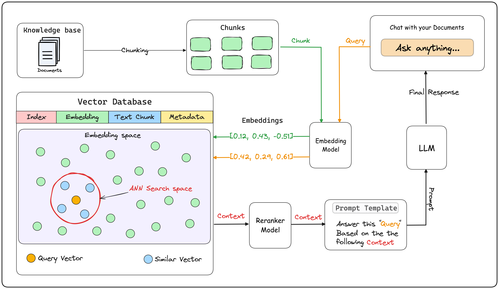
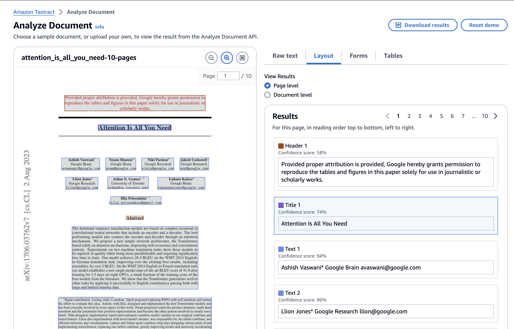

# Layout-aware document preprocessing for RAG

RAG based systems are a powerful approach to extend the context of LLM requests with additional relevant information.
Just chunking the text of documents into sentences or paragraphs is not enough to maintain the full context of the information.

Looking at a research paper for example, it can make a huge difference if a statement like ""The neural network achieved an accuracy of 95% on the test" is under the "Related work" or "Results" section. In the Related Work section it means that this level of accuracy has already been achieved in earlier studies. When the same statement appears in the "Results" section, it carries a different significance. It represents a finding from a current study and suggests that the researchers have developed a new or improved method.

In this repo we show how you can extend RAG systems by considering additional semantics using Layout-aware preprocessing.
We utilize Amazon Textract's layout feature. This feature allows you to extract content from your document while maintaining its layout and reading format. Amazon Textract Layout feature is able to detect the following sections:

* Titles
* Headers
* Sub-headers
* Text
* Tables
* Figures
* List
* Footers
* Page Numbers
* Key-Value pairs

# What is Retrieval Augmented Generation RAG?

The following diagram gives a detailled overview how RAG (Retrieval Agumented Generation) works. Image is based on [1](https://lightning.ai/lightning-ai/studios/rag-using-cohere-command-r).

# How to you use layout-aware document preprocessing ?

The main take aways are: 

* 0. Explore layout-aware document processing using [interactive Textract Demo in AWS Console](https://us-east-1.console.aws.amazon.com/textract/home?region=us-east-1#/demo) 
* 1. Utilize Langchain AmazonPDFLoader ([sample_notebook](01-langchain-textract.ipynb) 
* 2. [Amazon Textract Textractor Library](https://aws-samples.github.io/amazon-textract-textractor/index.html), [sample notebook](02-textractor.ipynb)
* 3. Textract API and AWS SDK

More complex examples:
* Asking questions on tabular data Notebook: example_01-qna-tabular-data .ipynb, [details](https://aws-samples.github.io/amazon-textract-textractor/notebooks/tabular_data_linearization_continued.html#)
* Converting PDF to HTML --> 02-textractor.ipynb
* Converting PDF to Markdown --> 02-textractor.ipynb
* TODO: take sm
webpages:
* Lanchain Playwright

## 1. Interactive Textract Demo in AWS console

Try the [interactive Textract Demo for layout analysis](https://us-east-1.console.aws.amazon.com/textract/home?region=us-east-1#/demo) in the AWS Console.

## 

Additional Resources

* [Deep dive into chunking of complex documents with layout analysis](https://github.com/aws-samples/layout-aware-document-processing-and-retrieval-augmented-generation/tree/main)