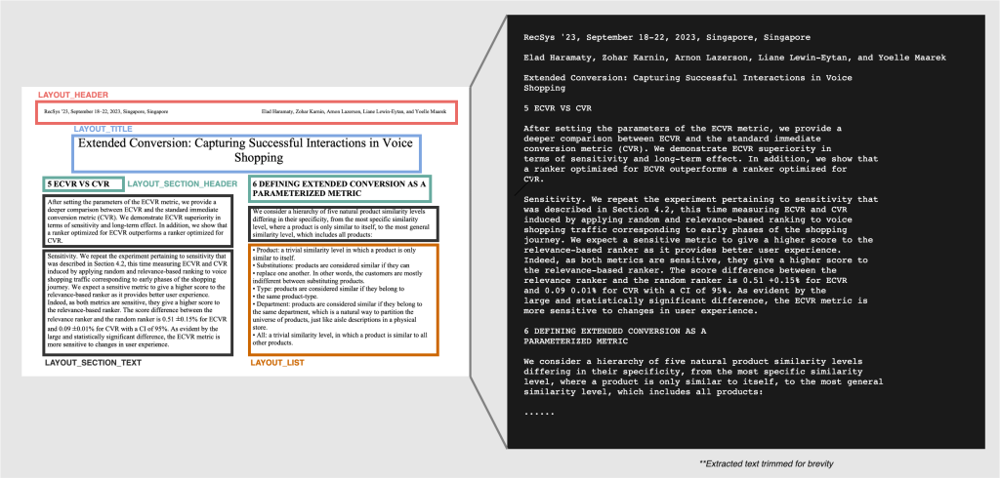
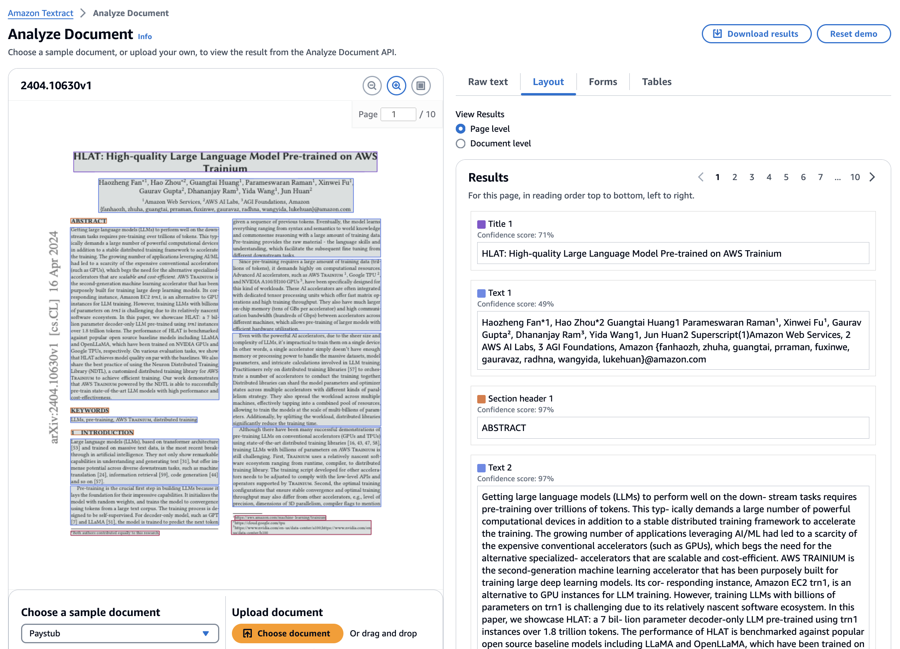

# Layout-aware document preprocessing for RAG

RAG based systems are a powerful approach to extend the context of LLM requests with additional relevant information.
Just chunking the text of documents into sentences or paragraphs is not enough to maintain the full context of the information.

Looking at a research paper for example, it can make a huge difference if a statement like ""The neural network achieved an accuracy of 95% on the test" is under the "Related work" or "Results" section. In the Related Work section it means that this level of accuracy has already been achieved in earlier studies. When the same statement appears in the "Results" section, it carries a different significance. It represents a finding from a current study and suggests that the researchers have developed a new or improved method.

In this repo we show how you can extend RAG systems by considering additional semantics using Layout-aware preprocessing.
We utilize [Amazon Textract's layout feature](https://aws.amazon.com/blogs/machine-learning/amazon-textracts-new-layout-feature-introduces-efficiencies-in-general-purpose-and-generative-ai-document-processing-tasks/). This feature allows you to extract content from your document while maintaining its layout and reading format. Amazon Textract Layout feature is able to detect the following sections:

* **Title** – The main title of the document.
* **Header** – Text located in the top margin of the document.
* **Footer** – Text located in the bottom margin of the document.
* **Section Title** – The titles below the main title that represent sections in the document.
* **Page Number** – The page number of the documents.
* **List** – Any information grouped together in list form.
* **Figure** – Indicates the location of an image in a document.
* **Table** – Indicates the location of a table in the document.
* **Key Value** – Indicates the location of form key-value pairs in a document.
* **Text** – Text that is present typically as a part of paragraphs in documents. It is a catch all for text that is not present in other elements.

# What is Retrieval Augmented Generation RAG?

Retrieval-Augmented Generation (RAG) is the process of optimizing the output of a large language model, so it references an authoritative knowledge base outside of its training data sources before generating a response. RAG extends the already powerful capabilities of LLMs to specific domains or an organization's internal knowledge base, all without the need to retrain the model. It is a cost-effective approach to improving LLM output so it remains relevant, accurate, and useful in various contexts.

The following diagram gives a detailled overview how RAG (Retrieval Agumented Generation) works. Image is based on [1](https://lightning.ai/lightning-ai/studios/rag-using-cohere-command-r).

The semantic and hierarchical structure of the documents needs to be additionally considered during the chunking step to improve the information retrieval results.

# What is Layout-ware preprocessing for RAG?

Documents often contain various elements like headings, paragraphs, tables, and lists that convey semantic meaning. Traditional chunking methods, which typically break text into fixed-size segments, can lead to a loss of context and meaning. Layout-aware preprocessing seeks to preserve the relationships between these elements by chunking them based on their logical structure rather than arbitrary token counts.

# How to use layout-aware document preprocessing ?

In this repo you will be able to explore the following approaches: 

* Try the [interactive Textract Demo with layout visualization in AWS Console](https://console.aws.amazon.com/textract/home?#/demo) 
* Utilize Langchain [AmazonPDFLoader](https://api.python.langchain.com/en/latest/document_loaders/langchain_community.document_loaders.pdf.AmazonTextractPDFLoader.html) ([sample_notebook](01-langchain-textract.ipynb)) 
* Utilize [Amazon Textract Textractor Library](https://aws-samples.github.io/amazon-textract-textractor/index.html) ([sample notebook](02-textractor.ipynb))
* [Textract API and AWS SDK](https://docs.aws.amazon.com/textract/latest/dg/sdk-general-information-section.html)

Additional Demos and Examples:

* [Converting PDF to HTML](02-textractor.ipynb#convert_to_html),  [02-textractor.ipynb](02-textractor.ipynb#convert_to_html)
* [Converting PDF to Markdown](02-textractor.ipynb#convert_to_md), [02-textractor.ipynb](02-textractor.ipynb#convert_to_md)
* [Layout-aware Chunking, incl. Figures](02-textractor.ipynb#layout_chunking),  [02-textractor.ipynb](02-textractor.ipynb#layout_chunking)
* [Q&A on Tabular Data](03-tabular-data-qna.ipynb), [03-tabular-data-qna.ipynb](03-tabular-data-qna.ipynb), [documentation](https://aws-samples.github.io/amazon-textract-textractor/notebooks/tabular_data_linearization_continued.html#)

## Interactive Textract Demo with Layout Visualization in AWS console

Try the [interactive Textract Demo for layout analysis](https://console.aws.amazon.com/textract/home?#/demo) in the AWS Console.

Additional Resources
* [Amazon Textract’s new Layout feature introduces efficiencies in general purpose and generative AI document processing tasks](https://aws.amazon.com/blogs/machine-learning/amazon-textracts-new-layout-feature-introduces-efficiencies-in-general-purpose-and-generative-ai-document-processing-tasks/)
* [Deep dive into chunking of complex documents with layout analysis](https://github.com/aws-samples/layout-aware-document-processing-and-retrieval-augmented-generation/tree/main)
